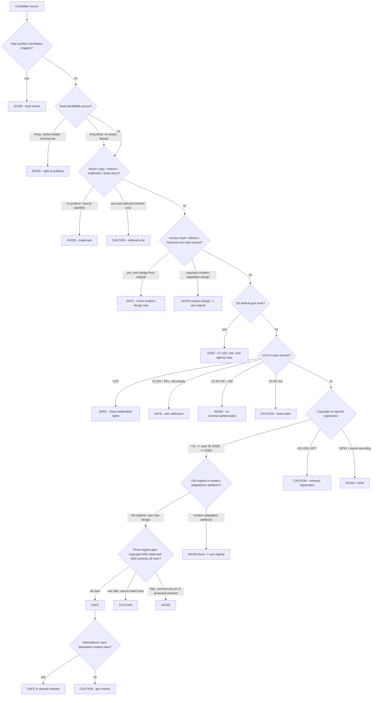

# Decision Tree — Safe / Caution / Avoid

> The executable policy. A human or an AI walks this flow for any candidate source and outputs one verdict — `safe`, `caution`, or `avoid` — plus a rationale and the specific thing to avoid. **At every uncertain fork, take the more restrictive branch.**

## Inputs the flow needs

- **What** is the candidate? (story / image / character / symbol / name / design / person / audio)
- **Publication year** and **country** of the *specific expression* you'd use.
- **Is it commercial?** (Polymath products are commercial → assume yes.)
- **Destination markets** (US + which others?).

## The output contract

The flow always emits an object like:

```json
{
  "verdict": "safe | caution | avoid",
  "rationale": "short why",
  "avoid_specifically": "the exact protected element to not touch (or null)",
  "safe_alternative": "what to use instead (when verdict is caution/avoid)",
  "regimes_checked": { "copyright": "...", "trademark": "...", "publicity": "..." }
}
```

## Plain-language flow

1. **Hate symbol / prohibited imagery?** → if yes → **AVOID** (hard refuse, no substitution of the symbol). See [[do-not-use]] §8. Else continue.
2. **Is it a real, identifiable person?**
   - Living, or deceased with an active estate (Elvis, Monroe, Einstein) → commercial use → **AVOID** (right of publicity). Editorial/factual long-dead figure (Lincoln, Cleopatra) → **CAUTION/SAFE**. See [[use-with-caution]] §8.
3. **Is it a brand / logo / mascot / trademarked name or trade dress?**
   - On a product / as a source identifier → **AVOID** (trademark). Named in accurate editorial commentary only → **CAUTION**. See [[copyright-vs-trademark-vs-likeness]], [[do-not-use]] §3–4.
4. **Is it an ancient myth / traditional folklore / historical symbol (non-hate)?**
   - And you use your **own** design from the ancient/traditional version → **SAFE**. But if you copy a **modern adaptation's** design (Marvel Thor, Disney Ariel, God of War gods) → **AVOID** that design; steer to original. See [[safe-to-use]] §3–5, [[pd-source-vs-modern-adaptation]].
5. **Is it a US federal government work (NASA, USGS, NOAA, etc.)?** → **SAFE** (17 USC 105). Don't add the agency's logo (trademark). See [[safe-to-use]] §6.
6. **Is it CC0 / openly licensed?**
   - CC0 → **SAFE** (still check embedded third-party rights). CC-BY / OFL → **SAFE if you comply** (attribution / license terms). CC-BY-NC / CC-BY-ND → **AVOID** for commercial/derivative use. CC-BY-SA → **CAUTION**. See [[safe-to-use]] §7–8.
7. **Copyright check on the specific expression** (see [[us-public-domain-cutoff]]):
   - US, published `≤ current_year − 95` (2026 → ≤1930), not in renewal-dependent zone → **copyright-clear**, continue.
   - US, 1931–1977 → **CAUTION** (renewal-dependent; verify).
   - 1978+ → **AVOID** (almost never expired).
   - Sound recording → **CAUTION** unless the specific recording's PD date is verified.
8. **Is what you want the OLD ORIGINAL expression, or a MODERN ADAPTATION's added elements?**
   - Old original / your own new design from it → continue toward SAFE.
   - Modern adaptation's distinctive additions (specific design, added characters, new translation, remaster) → **AVOID** those; steer to original. See [[pd-source-vs-modern-adaptation]].
9. **Final three-regime gate** (must pass all to be SAFE):
   - Copyright clear? **and** Trademark clear (no source confusion)? **and** Publicity clear (no recognizable real person commercially)? → **SAFE**.
   - Any one fails → **CAUTION** (if a narrow lawful lane exists) or **AVOID** (if commercial use of the protected element).
10. **International:** repeat steps 7–9 for each destination market's term. If a market isn't clear → geo-restrict or downgrade to **CAUTION/AVOID**.

> **Default rule at any uncertain node: take the more restrictive exit.** Conservative is correct.

## Mermaid flow



## Worked traces

**Trace 1 — "Medusa illustration for a poster, my own art":**
B no → C no → D no → E yes (ancient myth, own design) → not copying a modern game/film Medusa → **SAFE**. `avoid_specifically: null`.

**Trace 2 — "Universal Frankenstein monster on a t-shirt":**
B no → C (Karloff likeness) → also D (Universal design) → H: design is 1931 + separately protected → I: modern adaptation additions → **AVOID**. `avoid_specifically: "Universal's bolt-neck/green-skin 1931 design + Karloff likeness"`, `safe_alternative: "your own monster from Shelley's 1818 described Creature"`.

**Trace 3 — "Sherlock Holmes story (1925) retelling, my own prose & art":**
B no → C no → D (name — Conan Doyle estate trademark concerns) → H: 1925 story is PD → I: old original + own design → J: copyright clear, trademark = avoid using as a brand/logo but using the public-domain character in original fiction is generally fine, publicity n/a → **SAFE/CAUTION** (safe to retell the PD character in original prose; caution on using the name as a brand). `avoid_specifically: "estate-asserted late-story traits; modern film/BBC designs; using the name as a product brand"`.

**Trace 4 — "Pikachu sticker":**
B no → C no → D yes (Pokémon trademark + copyright) → **AVOID**. `safe_alternative: "original electric creature design"`.

**Trace 5 — "NASA Hubble nebula on a poster":**
B no → C no → D no → E no → F yes (US federal) → **SAFE**. `avoid_specifically: "the NASA logo/insignia"`.

## How an AI should apply this

Treat this document as the policy engine. For each candidate in a content plan, run the flow, attach the emitted object to the item, and **filter out anything that resolves to `avoid`**, flag anything `caution` for human review, and only auto-approve `safe`. Persist the verdict into each generated entry's `risk_level` / `risk_notes` frontmatter so the whole pipeline stays auditable.

## Related

- [[copyright-vs-trademark-vs-likeness]] — the three-regime gate at node 9
- [[us-public-domain-cutoff]] — node 7 mechanics
- [[pd-source-vs-modern-adaptation]] — node 8 trap
- [[safe-to-use]] / [[use-with-caution]] / [[do-not-use]] — the bucket each verdict maps to

---
*Part of the Polymath Source Material Bible — Section 01 Legal Guidelines. Not legal advice.*
