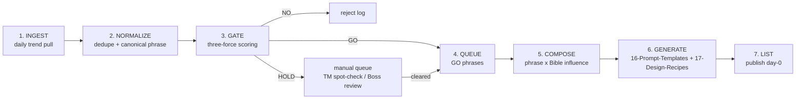

# Day-0 Pipeline — Daily Trend Ingestion to Design Queue

The operational engine behind the Trend Dictionary. It turns the abstract three-force gate ([[three-force-gate]]) into a **daily, automated workflow**: ingest fresh trends → gate them → queue the survivors → generate designs that span the creative Bible. The whole point is **speed**: catching a phrase on day 0, before the marketplace saturates.

---

## Why day-0 matters (the speed advantage)

POD on trend phrases is a race against saturation and trademark trolls:

- **Day 0–2 (rising):** Few listings exist. A clean, differentiated design captures organic search + algorithmic lift. **This is where the money is.**
- **Day 3–7 (peaking):** Thousands of near-identical listings flood Amazon/Etsy/Redbubble. Margins collapse.
- **Day 7+ (declining):** Trademark trolls have filed applications; takedowns begin; the phrase is cold.

So the pipeline optimizes for **time-to-queue**: detect → gate → generate in hours, not days. The gate is what keeps speed from becoming recklessness (account bans, takedowns).

---

## Pipeline stages



### 1. INGEST (daily)
Pull trending phrases/hashtags/sounds from the sources in [[sources]]:
- TikTok Creative Center (official trending hashtags/sounds)
- Google Trends via `pytrends` (rising queries)
- Reddit API (rising posts in relevant subs)
- X/Twitter trends
- Know Your Meme (newly documented memes)
- (Optionally, ToS-permitting) unofficial TikTok scrapers — see risk notes in [[sources]]

Output: a raw list of candidate phrases with `platform`, observed velocity, and `audience` hints.

### 2. NORMALIZE
Dedupe variants (spacing, plurals, emoji), pick a canonical phrase string, and merge with any existing `dictionary/` entry (so a re-detected phrase updates its `trend_status` rather than duplicating).

### 3. GATE (automated three-force scoring)
Run [[three-force-gate]] programmatically:
- **Trend force:** classify `trend_status` from velocity (rising/peaked/declining/dead).
- **Legal force:** automated USPTO TESS query (Class 25 + relevant classes) + marketplace branding scan → `trademark_status`, `copyright_baggage` heuristics, `publicity_risk` (creator-name detection) → `legal_verdict`.
- **Ethical force:** run the brand-safety screens ([[ethical/brand-safety-filter]]) — 12-yo heuristic, ADL coded-number/dog-whistle check, sexual-term lexicon, punching-down/origin flags → `ethical_verdict`, `twelve_yo_test`.

Compute `ship_decision` (GO / HOLD / NO). Write/update the `dictionary/` entry with full YAML frontmatter (DB-ready). NO → reject log. HOLD → manual queue.

### 4. QUEUE
GO phrases (and HOLD phrases that cleared manual review) enter the generation queue, prioritized by `trend_status` (rising > peaked > evergreen-meme) and freshness.

### 5. COMPOSE (span the creative Bible)
This is the differentiator. A GO phrase is **not** shipped as plain text. Each queued phrase is paired with a creative-Bible influence to produce a distinctive design brief:

```
design_brief = trend_phrase
             × art_movement   ([[../06-Historical-Art/README]])
             × visual_motif   ([[../13-Visual-Motifs/README]])
             × color_palette  ([[../08-Color-Palettes/README]])
             × archetype      ([[../10-Archetypes/README]])
```

Example: `"locked in"` × Bauhaus geometry × padlock motif × monochrome+accent palette × the Achiever archetype → a clean motivational poster that doesn't look like the 4,000 plain-text "locked in" tees.

The phrase's own `design_hooks` and `remix_hooks` (in its dictionary entry) seed this composition.

### 6. GENERATE
Hand the composed brief to:
- [[../16-Prompt-Templates/README]] — builds the actual generation prompt.
- [[../17-Design-Recipes/README]] — assembles the full product recipe (mockup, variants, copy).

> **This phrase-section feeds 16 and 17.** The Trend Dictionary supplies the *what* (vetted phrase + hooks); 16/17 produce the *output*.

### 7. LIST
Publish day-0 across `applications` (tshirt/sticker/mug/poster). For HOLD-origin phrases, confirm the TM spot-check is logged before mass production.

---

## Agent spec sketch

A `trend-scout` agent run on a schedule:

```
agent: trend-scout
schedule: daily 06:00 UTC (see cron below)
steps:
  1. INGEST   call source adapters (TikTok Creative Center, pytrends,
              Reddit API, X trends, Know Your Meme); collect candidates
  2. NORMALIZE dedupe -> canonical phrase; match existing dictionary/ entries
  3. GATE     for each candidate:
                - trend force: classify trend_status from velocity
                - legal force: USPTO TESS query (Class 25 + 16/21/09/35),
                  marketplace branding scan, creator-name detection
                - ethical force: brand-safety screens
                  (ADL coded-number check, sexual lexicon, origin flags,
                   12-yo heuristic)
                - compute ship_decision
  4. WRITE    create/update dictionary/trend-<kebab>.md with YAML frontmatter
  5. ROUTE    GO -> generation queue
              HOLD -> manual queue (notify Boss for TM spot-check / review)
              NO  -> reject log (with reason)
  6. REPORT   daily digest: # ingested, # GO/HOLD/NO, flagged-for-Boss list
guardrails:
  - unknown trademark_status NEVER auto-GO (cap at HOLD)
  - any ethical off-limits = NO, no override
  - respect source ToS (prefer official APIs; flag scraper use)
```

A separate `design-forge` agent consumes the GO queue, runs stage 5–6 (compose × generate via 16/17), and emits design briefs/mockups.

---

## Cron cadence

| Job | Cadence | Rationale |
|---|---|---|
| `trend-scout` full ingest + gate | **Daily, 06:00 UTC** | Day-0 detection; one pull per day catches rising phrases early. |
| `trend-scout` lightweight refresh | **Every 6h** (optional) | Re-classify `trend_status` of `rising`/`peaked` entries; catch fast movers. |
| `design-forge` queue drain | **Daily, after scout** | Generate briefs for the day's GO phrases. |
| Trademark re-check of live `GO`/`HOLD` | **Weekly** | Trolls file fast; a clear phrase can become `applied`/`registered` within days. Re-run TESS; demote if a mark appears. |
| Dead-trend sweep | **Weekly** | Demote `declining` → `dead`; pull stale listings to avoid shipping a dead trend. |

---

## Operating guardrails (restated)

- **Unknown TM = HOLD, never auto-GO.** Manual spot-check required.
- **Ethical off-limits = NO, no override**, regardless of trend heat.
- **Re-check live phrases weekly** — trademark status and trend status both decay fast.
- **Speed serves the gate, not the reverse.** A fast pipeline that ships baggage/innuendo/dead trends loses the account. The gate is non-negotiable.

> See also: [[three-force-gate]] · [[sources]] · [[legal/trademark-clearance]] · [[ethical/brand-safety-filter]] · [[../16-Prompt-Templates/README]] · [[../17-Design-Recipes/README]]
