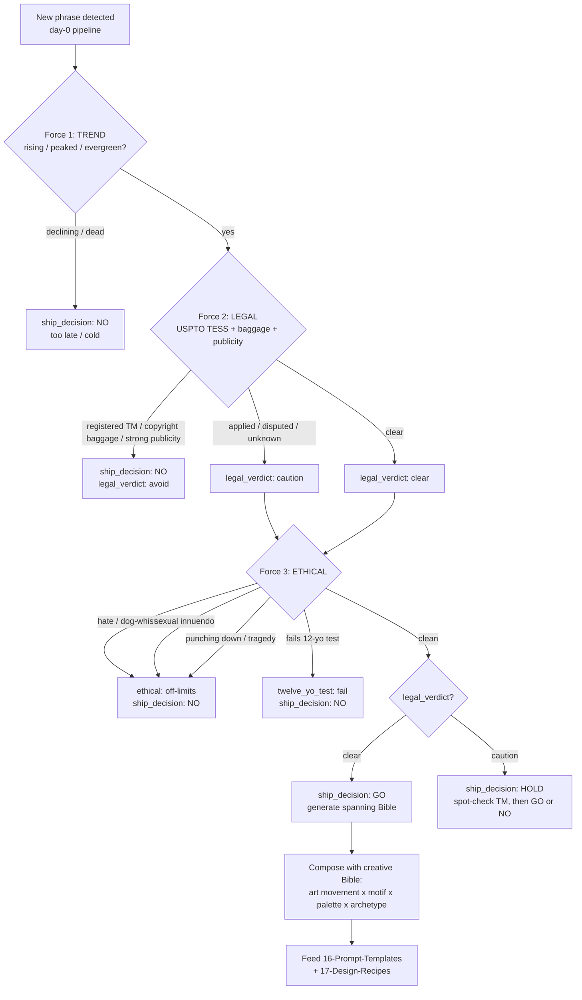

# The Three-Force Gate — Canonical Scoring Rubric

Every trending phrase passes through three independent forces before it can become a product. The forces are scored **in order** and the gate is **fail-fast**: a hard fail on any force short-circuits the rest and produces a `ship_decision` of `NO` (or `HOLD`). Only a phrase that clears all three earns `GO`.

> The three forces guiding AI generation in this section: **Modern Trend × Legal × Ethical.**

This mirrors how the creative Bible composes a design from multiple influences — but here the forces are *gates*, not *ingredients*. They decide **whether** to generate before the Bible decides **how**.

---

## Force 1 — TREND (is it actually hot right now?)

We are buying a wave. A phrase has value only while it is rising or freshly peaked. Detection happens day-0 from the sources in [[sources]].

**Track for every phrase:**

- `platform` — where it originated / is spiking (tiktok, youtube, instagram, x, twitch, reddit…)
- `trend_status` — one of:
  - `rising` — accelerating, not yet saturated. **Best window.**
  - `peaked` — at maximum attention; saturation imminent. Ship only if you can list *today*.
  - `declining` — past peak, attention falling. Usually too late.
  - `evergreen-meme` — never fully dies (e.g. classic CTAs); low urgency, steady low-volume demand.
  - `dead` — over. Do not ship.
- `audience` — who says it (Gen Alpha kids, Gen Z, gamers, beauty TikTok, sports fans…). Determines product placement and the 12-yo test calibration.

**Trend scoring:**

| `trend_status` | Trend force result |
|---|---|
| `rising` | **PASS** (highest priority) |
| `peaked` | **PASS** (ship today or skip) |
| `evergreen-meme` | **PASS** (low urgency) |
| `declining` | **FAIL** → `ship_decision: NO` |
| `dead` | **FAIL** → `ship_decision: NO` |

---

## Force 2 — LEGAL (is it clear to print?)

Full SOP in [[legal/trademark-clearance]]. Summary of the reframe:

> **US copyright does NOT protect short phrases, slogans, or titles.** The legal risk is **trademark** + **copyrighted baggage** + **right of publicity** — not the words themselves.

**Score three sub-checks:**

1. `trademark_status` — search USPTO TESS (`tmsearch.uspto.gov`) for the phrase in **Class 25 (apparel)** + relevant classes, plus a marketplace scan (Amazon/Etsy for existing branded listings):
   - `clear` — no live mark for relevant goods.
   - `applied` — intent-to-use / pending application exists.
   - `registered` — a live registered mark exists for relevant goods.
   - `disputed` — multiple filers / contested ownership.
   - `unknown` — could not verify.
2. `copyright_baggage` — does the "phrase" drag a copyrighted work with it? (`none`, or `"copyrighted series/characters"`, `"song lyric"`, `"movie quote"`, etc.) The bare word may be usable; the *character / art / lyric* is **not**.
3. `publicity_risk` — is it a catchphrase identifiably tied to one living person/creator? (`none` or `"tied to creator X"`.)

**Legal verdict mapping → `legal_verdict`:**

| Condition | `legal_verdict` |
|---|---|
| `trademark_status: clear` AND `copyright_baggage: none` AND `publicity_risk: none` | `clear` |
| `trademark_status: applied` OR `disputed`; OR `publicity_risk` present but phrase is generic; OR `trademark_status: unknown` | `caution` (spot-check first; no mass production) |
| `trademark_status: registered` for apparel; OR any `copyright_baggage` (series/characters/lyric/quote); OR strong `publicity_risk` on a person's signature catchphrase | `avoid` |

> **Default to caution.** `unknown` is never treated as `clear`.

---

## Force 3 — ETHICAL (the Boss's brand-safety gate)

Full screen in [[ethical/brand-safety-filter]]. A phrase is **off-limits** if **ANY** of the following is true:

1. **The 12-year-old test FAILS** (defined precisely below) — it's not actually funny/cool to the target audience; it's cringe, lame, try-hard, or a dead trend.
2. **Racist / hateful / discriminatory** connotation OR origin — including **coded dog-whistles** (innocuous-looking numbers/phrases that are coded hate symbols; screen against the ADL Hate Symbols Database and known dog-whistle lists).
3. **Sexual innuendo / double-entendre** in current usage (e.g. "gooning," "edging," "gyat" → sexual → off).
4. **Punching down** — mocking tragedy, disability, or derived from someone's victimization.

**Ethical verdict → `ethical_verdict`:**

- `clean` — passes the 12-yo test and all four screens.
- `caution` — borderline: ambiguous origin, mild edge, or audience-dependent. Allowed only with conservative rendering and Boss sign-off.
- `off-limits` — fails any hard screen (2, 3, 4) or is clearly cringe/dead (1).

---

### The 12-year-old test (precise definition)

> **Imagine the *exact* phrase, rendered on a tee, shown to a switched-on 12-year-old who is fluent in current internet culture. Their honest, unguarded reaction decides the verdict.**

- **PASS** if the reaction is genuine amusement/recognition/approval — *"that's actually funny / that's so real / I'd wear that."*
- **FAIL** if the reaction is any of:
  - **Cringe** — *"that's so cringe,"* try-hard, trying-to-be-cool-and-failing.
  - **Dated** — *"nobody says that anymore,"* the trend is over (a `declining`/`dead` `trend_status` almost always fails the 12-yo test).
  - **Adult-coded** — it reads as a brand or parent *performing* youth culture (marketing-speak, e.g. "fellow kids").

`twelve_yo_test` is recorded as `pass` or `fail`. A `fail` forces `ethical_verdict: off-limits` and therefore `ship_decision: NO`. Calibrate to the entry's `audience`, not to a generic adult.

---

## Combining the forces → `ship_decision`

```
GO   only if:  TREND passes (rising | peaked | evergreen-meme)
          AND  legal_verdict ∈ {clear, caution}
          AND  ethical_verdict == clean
          AND  twelve_yo_test == pass

HOLD if:      TREND passes
          AND  legal_verdict == caution   (needs spot-check)
          AND  ethical_verdict ∈ {clean, caution}
          (i.e. promising but must clear a manual legal/ethical check first)

NO   if:      TREND fails (declining | dead)
          OR  legal_verdict == avoid
          OR  ethical_verdict == off-limits
          OR  twelve_yo_test == fail
```

> **Note:** `caution` legal + `clean` ethical produces `HOLD`, not `GO`. `GO` requires the legal caution to be *resolved* by a spot-check first. The rule of thumb: **GO = trend hot AND legal clear (or caution-resolved-by-spot-check) AND ethical clean.**

---

## Decision flow



---

## After GO — generate spanning the creative Bible

A `GO` phrase is not shipped as plain text. It is composed with the creative Bible to differentiate it from the saturated wave of plain-text listings:

- `design_hooks` — how to render the phrase: typography, layout, motif pairing. Pulls from [[../13-Visual-Motifs/README]] and [[../08-Color-Palettes/README]].
- `remix_hooks` — combine the phrase with a creative influence: an art movement from [[../06-Historical-Art/README]], an archetype from [[../10-Archetypes/README]], a motif from [[../13-Visual-Motifs/README]].

These hooks are handed to [[../16-Prompt-Templates/README]] (to build the generation prompt) and [[../17-Design-Recipes/README]] (to assemble the full product recipe).

> All IP doctrine and edge-case adjudication defers to [[../01-Legal-Guidelines/README]].
